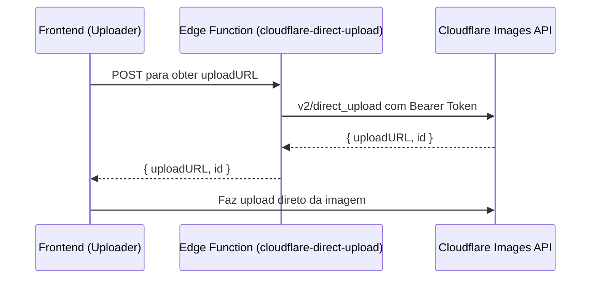

# AUDITORIA TÉCNICA COMPLETA

Data: 2025-10-15
Projeto: Aplicação React + Vite + Tailwind + TypeScript com Supabase e Edge Functions

Sumário
- 1. Visão Geral do Projeto
- 2. Dependências (Inventário)
- 3. Mapa do Repositório (Estrutura por diretório)
- 4. Frontend por Camadas
  - 4.1 Páginas (src/pages)
  - 4.2 Componentes (src/components)
  - 4.3 UI (src/components/ui)
  - 4.4 Hooks (src/hooks)
  - 4.5 Libs e Helpers (src/lib)
  - 4.6 Config e Constantes (src/config, src/constants)
  - 4.7 Tipos (src/types)
  - 4.8 Entrypoints (src/main.tsx, src/App.tsx)
- 5. Integração com Supabase
  - 5.1 Cliente Supabase
  - 5.2 Funções SQL / Triggers (existentes)
  - 5.3 Observações RLS (gerais)
- 6. Edge Functions (supabase/functions)
- 7. Segredos (Secrets) configurados
- 8. Fluxos Principais (diagramas Mermaid)
  - 8.1 Fluxo de Conteúdo (Produtos → Landing Pages → Blog → SEO → Publicação)
  - 8.2 Fluxo OAuth e Renovação de Tokens
  - 8.3 Upload de Imagens (Cloudflare)
- 9. Validações & Segurança
- 10. Integrações Externas (Google/Cloudflare/WordPress/FTP)
- 11. Conclusões Operacionais e Pontos Críticos
- 12. Apêndices (Índices e Glossário rápido)


1. Visão Geral do Projeto
- Stack: React 18, Vite, TypeScript, Tailwind CSS, shadcn (Radix UI), TanStack Query, Supabase (Auth, DB, Edge Functions).
- Objetivo: Sistema de gestão e publicação de conteúdo (produtos, blogs, landing pages), SEO, integrações Google (YouTube/Business), Cloudflare para imagens, e pipelines de IA via Lovable AI gateway nas Edge Functions.
- Destaques arquiteturais:
  - Componentização extensa (src/components/**), com UI reutilizável em src/components/ui.
  - Hooks de domínio para agregar/validar/gerar conteúdo (src/hooks/**).
  - Edge Functions para geração/extração/publicação/integrações externas (supabase/functions/**).
  - Integração Supabase centralizada e segura via secrets.


2. Dependências (Inventário)
Lista principal (nome → versão):
- @hello-pangea/dnd → ^18.0.1
- @hookform/resolvers → ^3.10.0
- @radix-ui/* (accordion, alert-dialog, etc.) → versões 1.x/2.x conforme diretórios
- @supabase/supabase-js → ^2.56.0
- @tanstack/react-query → ^5.83.0
- @tiptap/* (editor) → ^3.x
- class-variance-authority → ^0.7.1
- clsx → ^2.1.1
- cmdk → ^1.1.1
- date-fns → ^3.6.0
- embla-carousel-react → ^8.6.0
- lucide-react → ^0.462.0
- marked → ^16.3.0
- mustache → ^4.2.0
- next-themes → ^0.3.0
- papaparse / @types/papaparse → ^5.5.3 / ^5.3.16
- react, react-dom → ^18.3.1
- react-hook-form → ^7.61.1
- react-router-dom → ^6.30.1
- recharts → ^2.15.4
- sonner → ^1.7.4
- tailwind-merge → ^2.6.0
- tailwindcss-animate → ^1.0.7
- tsx → ^4.20.6
- vaul → ^0.9.9
- zod → ^3.25.76
- zustand → ^5.0.8
Observações:
- Conjunto shadcn + Radix para UI acessível.
- Tiptap para rich text.
- React Query para data fetching e caching.
- Supabase JS v2 atualizado.


3. Mapa do Repositório (Estrutura por diretório)
- Raiz
  - index.html, vite.config.ts, tailwind.config.ts, src/, public/, supabase/, docs/, tests/, scripts/
  - Documentação variada (README.md, DOCUMENTACAO_*.md, OAUTH_*_GUIDE.md, etc.)
- src/
  - assets/: imagens do app
  - components/: componentes de domínio e gerais; subpastas google-ads e ui
  - config/, constants/: configurações e chaves de storage
  - contexts/: contextos globais (ex.: CategoryContext)
  - hooks/: hooks de domínio de produtos, SEO, auto-save, acessibilidade, etc.
  - integrations/supabase/: client.ts (gerado), types.ts (read-only)
  - lib/: helpers de negócio (oauth, template engine, schema, links, google-ads)
  - pages/: páginas do app (Editor, Dashboard, OAuth, etc.)
  - services/: entradas para estratégias de blog
  - styles/: design-system.css e index.css (tokens)
  - main.tsx, App.tsx
- supabase/
  - config.toml
  - functions/: Edge Functions (muitas integrações e automações)
  - migrations/: (read-only)
- docs/: guias de OAuth (YouTube/Google Business), arquitetura, etc.


4. Frontend por Camadas
4.1 Páginas (src/pages)
- Auth.tsx, AuthLaunch.tsx, OAuthLaunch.tsx, OAuthCallback.tsx, PasswordReset.tsx
  - Fluxo de autenticação e OAuth (init/launch/callback), reset de senha.
- Dashboard.tsx
  - Visão geral com KPIs/atalhos para gestores (produtos, blogs, SEO, etc.).
- Index.tsx
  - Home/landing inicial do app.
- BlogEditor.tsx, Editor.tsx
  - Edição e curadoria de conteúdo (blogs/landing pages), integração com hooks e componentes de preview.
- CodeView.tsx
  - Visualizador de código/artefatos gerados.
- CloudflareSettings.tsx, PublicationSettings.tsx
  - Configurações de publicação/CDN e SEO.
- GoogleBusinessOAuthSettings.tsx, YouTubeOAuthSettings.tsx
  - Configurações de OAuth para Google Business e YouTube.
- Repository.tsx
  - Repositório central de produtos/dados.
- NotFound.tsx
  - 404.

4.2 Componentes (src/components)
- Núcleo de domínio
  - Product* (seleção, edição, SEO, migração, estatísticas, vídeos, variações, etc.)
  - Blog* (EditorSection, Preview, Consolidation interfaces)
  - Reviews*, CSV* (importação e moderação)
  - OAuthSettingsCard, GoogleMerchantManager, IntelligentLinksManager, KOLManager
  - SystemMonitoringDashboard, SystemDataStatus, AdminStatusBadge
  - UI de navegação: TopNavigation, BreadcrumbNavigation
  - Social/Marketing: InstagramCopyGenerator, TikTokContentGenerator, YouTubeDescriptionGenerator, WhatsApp* generators
- Subpasta google-ads/
  - GoogleAdsTab, ProductGoogleAdsModal, KeywordManager, SitelinksManager, VideoManager, AdPreviewCards, WarningsPanel, GoogleAdsHistoryManager, UTMBuilder
- Utilitários visuais
  - OptimizedImage, ImageUploader, ImageDebugPreview, VideoSection, VideoTestimonialsSection, Image selectors
- Acessórios
  - AutoSaveIndicator, CompletionBadges, ScoreIndicators, TutorialLists, etc.

4.3 UI (src/components/ui)
- Conjunto shadcn: accordion, alert-dialog, badge, button, card, carousel, command, dialog, drawer, dropdown, form, input, label, menubar, navigation-menu, pagination, popover, progress, radio-group, resizable, scroll-area, select, separator, sheet, sidebar, skeleton, slider, sonner (toasts), switch, table, tabs, tag-input, textarea, toggle, toggle-group, tooltip, etc.
- Observação: Variantes devem obedecer tokens do design system (index.css, tailwind.config.ts) com HSL semantic tokens.

4.4 Hooks (src/hooks)
- Categorias/Produtos/Links/Keywords: useProduct*, useCategory*, useLinksRepository, useKeywordsRepository
- SEO/Schema: useProductSchemaGenerator, useAdvancedSchemaGenerator, useSEOHTMLGenerator
- Conteúdo/IA: useEnhancedTemplateEngine, useProductBlogsIntegration, useAfterSalesMessages, useCSMessages, useTargetAudienceAggregator
- Acessibilidade/UX: useFAQAccessibility, useHTML5Landmarks, useImageLazyLoad, useImageCache, useBlogReadMore
- Estado e utilidades: useDebounce, useMobile, useSelectedProducts, useLandingPages* (inclui Supabase), usePromptsConfiguration, useSystemMonitoring, useOAuth

4.5 Libs e Helpers (src/lib)
- oauth.ts, oauth-launcher.ts → fluxos OAuth e utilidades
- template-engine.ts, enhanced template engine
- schema-* (consolidator, reviews) e validate-jsonld
- intelligent-links*, auto-link.ts
- google-ads/* (collectors, csv-builder, validators)
- reviews.ts, sanitize-internal-labels.ts, tracking-injector.ts, utils.ts, deepMerge.ts

4.6 Config e Constantes
- src/config/domain-config.ts, feature-flags.ts
- src/constants/storage-keys.ts

4.7 Tipos (src/types)
- google-ads.ts, reviews.ts (tipagens fundamentais para integrações e UI)

4.8 Entrypoints
- src/main.tsx: criação da app, providers (tema, query), roteamento base.
- src/App.tsx: layout raiz, navegação de alto nível, rotas.


5. Integração com Supabase
5.1 Cliente Supabase
- Arquivo: src/integrations/supabase/client.ts (gerado automaticamente)
  - URL: https://pgfgripuanuwwolmtknn.supabase.co
  - Publishable key (anon) armazenada e usada.
  - Persistência de sessão (localStorage), auto-refresh habilitado.

5.2 Funções SQL / Triggers existentes (inventário)
- has_role(user_id uuid, role app_role) → boolean
- get_current_user_role() → app_role
- update_updated_at_column() → trigger
- update_oauth_updated_at() → trigger
- update_external_links_updated_at() → trigger
- update_google_oauth_tokens_updated_at() → trigger
- promote_user_to_admin(_email text) → boolean
- handle_new_user() → trigger (perfis + roles; login Google promove a admin)
- validate_blog_content() → trigger (regras rígidas de comprimento/keywords)
- log_prompt_usage() → trigger (métricas + system_monitoring)
- calculate_product_score(product_id uuid) → jsonb (score detalhado 120 pts)
- calculate_landing_page_score(lp_id text) → jsonb (score detalhado 165 pts)
- validate_blog_content_soft() → trigger (avisos, não bloqueia)
- update_product_completion_score() → trigger (atualiza tracking)
- update_landing_page_completion_score() → trigger (atualiza tracking)
- validate_product_price() → trigger
- validate_product_urls() → trigger (warnings de protocolo)
- validate_product_stock() → trigger
Observações:
- Triggers de cálculo de score alimentam content_completion_tracking.
- Funções de promoção/roles: cuidado com whitelists e Google OAuth.

5.3 Observações RLS (gerais)
- Não foi incluída a listagem completa das políticas RLS aqui; manter padrão: dados sensíveis por usuário com policies específicas.
- Edge Functions com verify_jwt_token conforme necessidade (ver config), e validações de origem onde crítico.


6. Edge Functions (supabase/functions)
Inventário por pasta (todas possuem index.ts):
- ai-content-generator, ai-seo-generator, auto-seo-enhancer
- consolidate-keywords, export-google-ads-csv, export-product-ai-playbook, export-product-google-ads-csv, export-repository-csv
- extract-google-reviews, extract-product-data, extract-youtube-captions
- generate-ad-copies, generate-merchant-feed, generate-product-ai-content (+ prompt-variables.ts), generate-product-blog
- generate-robots-txt, generate-sitemap, generate-social-content, generate-tiktok-content, generate-video-sitemap
- import-loja-integrada-api, import-repository-csv, migrate-products-to-repository, migrate-video-data
- moderate-reviews, optimize-image, publish-blog-post
- refresh-google-token, rename-category, strategic-blog-generator, test-ftp-connection, test-google-business-connection, test-wordpress-connection, test-youtube-connection
- update-secret, upload-image, validate-schema
- cloudflare-direct-upload (Proxy para Cloudflare Images direct upload)
  - Requer: CLOUDFLARE_API_TOKEN, CLOUDFLARE_ACCOUNT_ID
  - CORS, validação de método POST, mapeia v2/direct_upload
- exchange-youtube-code (Troca code → refresh_token YouTube)
  - Sanitiza redirect_uri contra ALLOWED; POST para https://oauth2.googleapis.com/token
- exchange-google-business-code (Troca code → refresh_token Google Business)
  - Sanitiza redirect_uri; POST para https://oauth2.googleapis.com/token
- exchange-oauth-code (Universal: youtube | googleBusiness)
  - Segurança: valida Origin (ALLOWED_ORIGINS), autentica usuário (JWT), busca client_id/client_secret em oauth_client_configs, valida redirect_uri, troca code no Google, salva refresh_token em oauth_credentials (upsert).
- _shared/dual-ai-competition.ts (módulo auxiliar)
  - Integra Lovable AI e DeepSeek; avalia conteúdo (estrutura, legibilidade, keywords, acurácia, engajamento) e seleciona melhor.

Observações de segurança:
- Funções de exchange: sanitização de redirect_uri, whitelists de origem, uso de secrets (client secret no DB/Secrets), não expõe segredo no cliente.
- Funções de Cloudflare: validações de credenciais e tratamento de erros específicos via status codes.


7. Segredos (Secrets) configurados (inventário)
- CLOUDFLARE_ACCOUNT_HASH, CLOUDFLARE_ACCOUNT_ID, CLOUDFLARE_API_TOKEN
- DEEPSEEK_API_KEY
- GOOGLE_CLIENT_ID, GOOGLE_CLIENT_SECRET
- LOJA_INTEGRADA_API_KEY
- SUPABASE_URL, SUPABASE_PUBLISHABLE_KEY, SUPABASE_ANON_KEY, SUPABASE_SERVICE_ROLE_KEY, SUPABASE_DB_URL
- LOVABLE_API_KEY
- YOUTUBE_CLIENT_ID, YOUTUBE_CLIENT_SECRET, YOUTUBE_API_KEY, YOUTUBE_REFRESH_TOKEN
Observações:
- LOVABLE_API_KEY é usado somente em Edge Functions para gateway de IA (nunca no cliente).
- Segredos Google e YouTube apenas em backend.


8. Fluxos Principais (diagramas Mermaid)
8.1 Fluxo de Conteúdo
```mermaid
flowchart TD
  A[Produtos Repositório] -->|IDs selecionados| B[Landing Page Editor]
  B --> C[Template Engine]
  C --> D[Preview / Blog Generator]
  D --> E[SEO Generator]
  E --> F[Publicação (Edge Functions)]
  F --> G[Sitemaps / Robots / Video Sitemap]
```

8.2 Fluxo OAuth e Renovação de Tokens
```mermaid
sequenceDiagram
  participant UI as Frontend (Settings/OAuth)
  participant EF as Edge Function (exchange-oauth-code)
  participant G as Google OAuth
  participant DB as Supabase (oauth_* tables)

  UI->>G: Autoriza e obtém code
  UI->>EF: POST { code, provider, config_id }
  EF->>DB: Valida usuário (JWT); busca client_id/secret
  EF->>G: Troca code por tokens
  G-->>EF: refresh_token
  EF->>DB: Upsert oauth_credentials
  EF-->>UI: Sucesso
```

8.3 Upload de Imagens (Cloudflare)



9. Validações & Segurança
- SQL (Triggers/Functions): validações rígidas de blog (título 10-60, conteúdo 500+, 3 keywords ao publicar), products (preço, estoque, URLs), cálculo de scores e tracking.
- Edge Functions: CORS e ORIGIN whitelist; sanitização de redirect_uri; autenticação via JWT para operações sensíveis; uso exclusivo de secrets no backend.
- Frontend: componentes shadcn com acessibilidade; hooks de lazy load de imagem; FAQ accessibility; landmarks HTML5 (useHTML5Landmarks).


10. Integrações Externas
- Google APIs:
  - OAuth (YouTube/Business) – troca de code e refresh, testes de conexão.
  - YouTube Captions – extração via edge function.
- Cloudflare Images – direct upload proxy e otimização de imagem.
- WordPress – teste de conexão/publicação (edge function).
- FTP – teste de conexão (edge function).
- Lovable AI Gateway – geração de conteúdo (chat/completions) e pipelines IA.


11. Conclusões Operacionais e Pontos Críticos
- Segurança OAuth: manter ALLOWED_ORIGINS/redirect URIs atualizados; nunca expor client_secret no cliente.
- IA: Sempre via Edge Functions usando LOVABLE_API_KEY; tratar 429/402 (rate limit/creditos) e exibir toasts no app.
- Imagens: Usar upload direto Cloudflare para performance; garantir lazy loading e alt text descritivo (SEO).
- SEO: Sitemaps/robots gerados; garantir canonical, H1 único por página, meta description 50-160 chars.
- Repositório de Produtos como fonte única; IDs em landing pages evitam duplicação (ver REFACTORING_STATUS.md).


12. Apêndices
12.1 Índice por Pastas (resumo)
- src/components: UI de domínio e utilitários (inclui google-ads/)
- src/components/ui: base shadcn (Radix) – botões, diálogos, inputs etc.
- src/hooks: lógica de negócio por domínio (SEO, produtos, IA, acessibilidade)
- src/lib: helpers e integrações (oauth, google-ads, schema, links, template engine)
- src/pages: rotas principais e telas de edição/integração
- supabase/functions: automações, geração/extração/publicação, integrações externas

12.2 Glossário rápido
- Edge Function: Função serverless em Deno hospedada no Supabase.
- RLS: Row Level Security – políticas de acesso por linha no Postgres.
- shadcn/Radix: Sistema de componentes acessíveis.
- Tiptap: Editor rich text extensível.
- Lovable AI Gateway: API compatível com OpenAI para modelos Gemini/GPT via backend.

Fim do documento.
