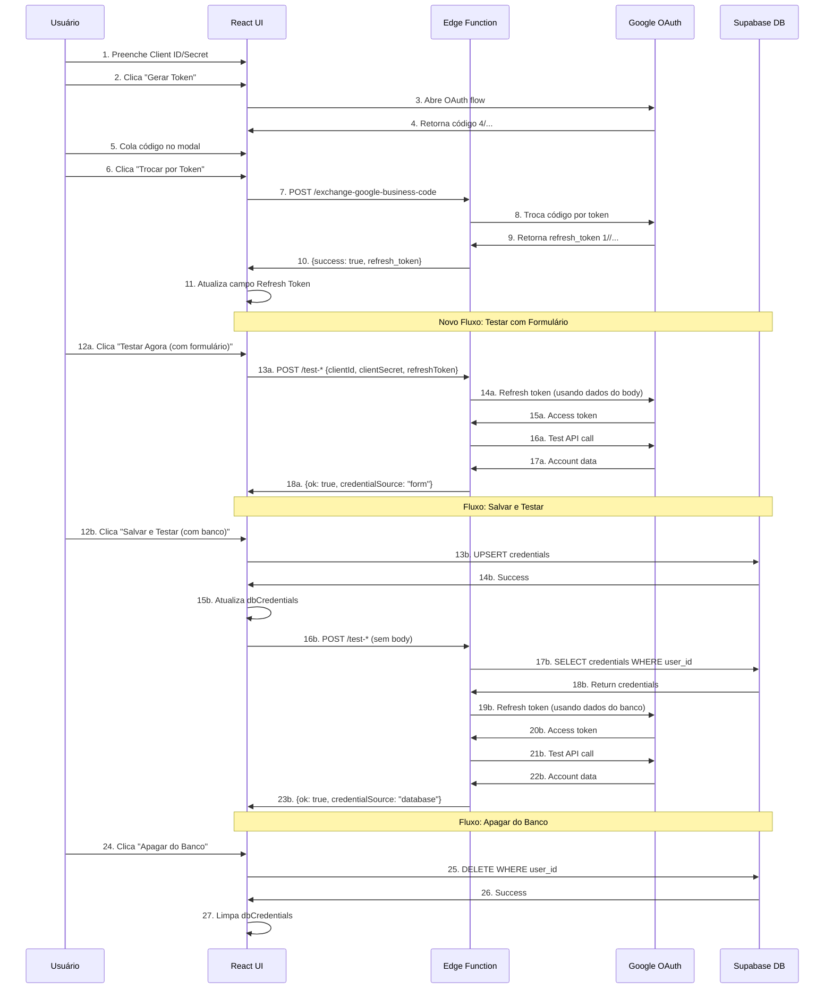

# Google Business Profile OAuth 2.0 - Código Completo

## 1. Backend - Edge Functions

### 1.1. exchange-google-business-code/index.ts

```typescript
import { serve } from "https://deno.land/std@0.168.0/http/server.ts";

const corsHeaders = {
  'Access-Control-Allow-Origin': '*',
  'Access-Control-Allow-Headers': 'authorization, x-client-info, apikey, content-type',
};

const json = (body: unknown) =>
  new Response(JSON.stringify(body), {
    status: 200,
    headers: { ...corsHeaders, 'Content-Type': 'application/json' },
  });

serve(async (req: Request) => {
  if (req.method === 'OPTIONS') {
    return new Response(null, { headers: corsHeaders });
  }

  try {
    const { code, clientId, clientSecret, redirectUri } = await req.json();
    const effectiveRedirectUri =
      redirectUri || Deno.env.get("GOOGLE_BUSINESS_REDIRECT_URI") || "https://landing-craftsman-76.lovable.app/oauth2/callback";
    const expectedRedirectUri = Deno.env.get("GOOGLE_BUSINESS_REDIRECT_URI") || "https://landing-craftsman-76.lovable.app/oauth2/callback";

    if (!code || !clientId || !clientSecret || !effectiveRedirectUri) {
      return json({
        success: false,
        error: "missing_params",
        error_description: "Parâmetros obrigatórios ausentes",
        details: { clientIdLast6: clientId?.slice(-6), redirectUri: effectiveRedirectUri },
      });
    }

    // Validar formato do Client ID
    if (!clientId.includes('.apps.googleusercontent.com')) {
      return json({
        success: false,
        error: "invalid_client_id_format",
        error_description: "Client ID deve ter formato: 123456789-abc.apps.googleusercontent.com",
        details: { 
          clientIdReceived: clientId.slice(0, 30) + '...',
          expectedFormat: 'XXXXXXXXX-XXXX.apps.googleusercontent.com'
        },
      });
    }

    // Validar se não enviaram Client Secret como Client ID
    if (clientId.startsWith('GOCSPX-')) {
      return json({
        success: false,
        error: "client_secret_in_client_id",
        error_description: "ERRO: Você enviou o Client Secret no campo Client ID. Corrija as credenciais.",
        details: { 
          hint: 'Client ID deve terminar com .apps.googleusercontent.com, não começar com GOCSPX-'
        },
      });
    }

    // Validar formato do Client Secret
    if (!clientSecret.startsWith('GOCSPX-')) {
      return json({
        success: false,
        error: "invalid_client_secret_format",
        error_description: "Client Secret deve começar com GOCSPX-",
        details: { 
          clientSecretPreview: clientSecret.slice(0, 10) + '...'
        },
      });
    }

    const tokenRes = await fetch("https://oauth2.googleapis.com/token", {
      method: "POST",
      headers: { "Content-Type": "application/x-www-form-urlencoded" },
      body: new URLSearchParams({
        code,
        client_id: clientId,
        client_secret: clientSecret,
        redirect_uri: effectiveRedirectUri,
        grant_type: "authorization_code",
      }),
    });
    const tokenData = await tokenRes.json();

    console.log("exchange-google-business-code", {
      ok: tokenRes.ok,
      status: tokenRes.status,
      google_error: tokenData?.error,
      google_error_description: tokenData?.error_description,
      clientIdLast6: clientId.slice(-6),
      redirectUriReceived: effectiveRedirectUri,
      expectedRedirectUri,
      redirectMatch: effectiveRedirectUri === expectedRedirectUri,
      codePreview: String(code).slice(0, 10) + "...",
      codeLength: code.length,
    });

    if (!tokenRes.ok || !tokenData?.refresh_token) {
      let probableCause = "unknown";
      
      if (tokenData?.error === "invalid_grant") {
        if (tokenData?.error_description?.includes("redirect_uri")) {
          probableCause = "redirect_uri_mismatch";
        } else if (tokenData?.error_description?.includes("Bad Request")) {
          probableCause = "code_expired_or_reused";
        }
      }

      return json({
        success: false,
        error: tokenData?.error || "unknown_error",
        error_description: tokenData?.error_description || "Falha ao trocar código por token",
        probable_cause: probableCause,
        details: {
          status: tokenRes.status,
          redirectMatch: effectiveRedirectUri === expectedRedirectUri,
          clientIdLast6: clientId.slice(-6),
        },
      });
    }

    return json({
      success: true,
      refresh_token: tokenData.refresh_token,
    });
  } catch (err) {
    console.error("exchange-google-business-code exception", err);
    return json({
      success: false,
      error: "exception",
      error_description: "Erro inesperado na Edge Function",
    });
  }
});
```

### 1.2. test-google-business-connection/index.ts (Parte 1/2)

```typescript
import { serve } from "https://deno.land/std@0.168.0/http/server.ts";
import { createClient } from 'https://esm.sh/@supabase/supabase-js@2.56.0';

const corsHeaders = {
  'Access-Control-Allow-Origin': '*',
  'Access-Control-Allow-Headers': 'authorization, x-client-info, apikey, content-type',
};

function logPreview(value: string, label: string = ''): void {
  const preview = value.length > 50 ? `${value.substring(0, 50)}...` : value;
  console.log(`${label}: ${preview}`);
}

serve(async (req) => {
  if (req.method === 'OPTIONS') {
    return new Response(null, { headers: corsHeaders });
  }

  try {
    const supabaseClient = createClient(
      Deno.env.get('SUPABASE_URL') ?? '',
      Deno.env.get('SUPABASE_SERVICE_ROLE_KEY') ?? '',
      { auth: { persistSession: false } }
    );

    console.log('🔍 Checking Google Business OAuth credentials...');

    // Parse request body for optional credentials
    const body = await req.json().catch(() => ({}));
    const {
      clientId: bodyClientId,
      clientSecret: bodyClientSecret,
      refreshToken: bodyRefreshToken,
    } = body;

    let clientId, clientSecret, refreshToken;
    let credentialSource = 'environment';

    // Priority: body > database > environment
    if (bodyClientId && bodyClientSecret && bodyRefreshToken) {
      console.log('🔵 Using credentials from request body (form data)');
      clientId = bodyClientId;
      clientSecret = bodyClientSecret;
      refreshToken = bodyRefreshToken;
      credentialSource = 'form';
    } else {
      // Try database if user is authenticated
      const authHeader = req.headers.get('Authorization');
      if (authHeader) {
        const token = authHeader.replace('Bearer ', '');
        const { data: { user } } = await supabaseClient.auth.getUser(token);
        
        if (user) {
          const { data: credsData } = await supabaseClient
            .from('google_business_oauth_credentials')
            .select('client_id, client_secret, refresh_token')
            .eq('user_id', user.id)
            .single();

          if (credsData) {
            clientId = credsData.client_id;
            clientSecret = credsData.client_secret;
            refreshToken = credsData.refresh_token;
            credentialSource = 'database';
            console.log('✅ Using credentials from database for user:', user.id);
          }
        }
      }

      // Fallback to environment variables
      if (!clientId || !clientSecret || !refreshToken) {
        console.log('⚠️ Using credentials from environment variables');
        clientId = clientId || Deno.env.get('GOOGLE_BUSINESS_CLIENT_ID');
        clientSecret = clientSecret || Deno.env.get('GOOGLE_BUSINESS_CLIENT_SECRET');
        refreshToken = refreshToken || Deno.env.get('GOOGLE_BUSINESS_REFRESH_TOKEN');
        if (!credentialSource || credentialSource === 'environment') {
          credentialSource = 'environment';
        }
      }
    }
    
    if (!clientId || !clientSecret || !refreshToken) {
      const missing = [];
      if (!clientId) missing.push('GOOGLE_BUSINESS_CLIENT_ID');
      if (!clientSecret) missing.push('GOOGLE_BUSINESS_CLIENT_SECRET');
      if (!refreshToken) missing.push('GOOGLE_BUSINESS_REFRESH_TOKEN');
      
      console.log('❌ Missing secrets:', missing.join(', '));
      
      return new Response(
        JSON.stringify({ 
          ok: false,
          error: 'Missing Google Business OAuth credentials',
          missing 
        }),
        { status: 200, headers: { ...corsHeaders, 'Content-Type': 'application/json' } }
      );
    }

    // Validar formato das credenciais ANTES de usar
    if (!clientId.includes('.apps.googleusercontent.com')) {
      console.error('❌ Client ID com formato inválido:', clientId.slice(0, 30));
      return new Response(
        JSON.stringify({ 
          ok: false,
          error: 'Invalid Client ID format',
          suggestion: 'Client ID deve terminar com .apps.googleusercontent.com',
          details: { clientIdPreview: clientId.slice(0, 30) + '...' }
        }),
        { status: 200, headers: { ...corsHeaders, 'Content-Type': 'application/json' } }
      );
    }

    if (clientId.startsWith('GOCSPX-')) {
      console.error('❌ Client Secret detectado no campo Client ID!');
      return new Response(
        JSON.stringify({ 
          ok: false,
          error: 'Client Secret in Client ID field',
          suggestion: 'Você colocou o Client Secret no lugar do Client ID. Corrija as credenciais.',
        }),
        { status: 200, headers: { ...corsHeaders, 'Content-Type': 'application/json' } }
      );
    }

    if (!clientSecret.startsWith('GOCSPX-')) {
      console.error('❌ Client Secret com formato inválido');
      return new Response(
        JSON.stringify({ 
          ok: false,
          error: 'Invalid Client Secret format',
          suggestion: 'Client Secret deve começar com GOCSPX-',
        }),
        { status: 200, headers: { ...corsHeaders, 'Content-Type': 'application/json' } }
      );
    }

    if (refreshToken.startsWith('GOCSPX-')) {
      console.error('❌ Client Secret detectado no campo Refresh Token!');
      return new Response(
        JSON.stringify({ 
          ok: false,
          error: 'Client Secret in Refresh Token field',
          suggestion: 'Você colocou o Client Secret no lugar do Refresh Token. Gere um token válido via OAuth.',
        }),
        { status: 200, headers: { ...corsHeaders, 'Content-Type': 'application/json' } }
      );
    }

    if (refreshToken.startsWith('4/')) {
      console.error('❌ Código de autorização detectado no campo Refresh Token!');
      return new Response(
        JSON.stringify({ 
          ok: false,
          error: 'authorization_code_in_refresh',
          suggestion: 'Você colou um código OAuth (4/...) no lugar do Refresh Token. Use o botão "Trocar por Token" no modal para obter o Refresh Token válido (1//).',
        }),
        { status: 200, headers: { ...corsHeaders, 'Content-Type': 'application/json' } }
      );
    }

    logPreview(clientId, '✅ Client ID');
    logPreview(clientSecret, '✅ Client Secret');
    logPreview(refreshToken, '✅ Refresh Token');
    
    // Detectar formato antigo de token
    if (refreshToken?.startsWith("4/")) {
      console.warn("⚠️ Token formato antigo detectado (OAuth Playground). Recomenda-se gerar novo via app.");
    }
    console.log(`🔍 Token type: ${refreshToken?.startsWith("1/") ? "Production" : "Playground/Test"}`);
    console.log(`🔍 Credential source: ${credentialSource}`);

    // Continue in Part 2...
```

### 1.3. test-google-business-connection/index.ts (Parte 2/2)

```typescript
    // ... continued from Part 1

    console.log('🔄 Exchanging refresh_token for access_token...');
    const tokenResponse = await fetch('https://oauth2.googleapis.com/token', {
      method: 'POST',
      headers: { 'Content-Type': 'application/x-www-form-urlencoded' },
      body: new URLSearchParams({
        client_id: clientId,
        client_secret: clientSecret,
        refresh_token: refreshToken,
        grant_type: 'refresh_token',
      }),
    });

    const tokenData = await tokenResponse.json();

    if (!tokenResponse.ok) {
      console.error('❌ Token refresh failed:', tokenData);
      
      const suggestion = refreshToken?.startsWith("4/")
        ? "Token antigo detectado. Gere novo via fluxo OAuth do app (não use OAuth Playground)"
        : "Verifique se redirect URI e escopos estão corretos no GCP";

      return new Response(
        JSON.stringify({ 
          ok: false,
          error: tokenData.error_description || 'Failed to refresh access token',
          suggestion,
          credentialSource,
          details: {
            ...tokenData,
            clientIdLast6: clientId.slice(-6),
            refreshTokenPreview: refreshToken.slice(0, 10) + "...",
          }
        }),
        { status: 200, headers: { ...corsHeaders, 'Content-Type': 'application/json' } }
      );
    }

    const accessToken = tokenData.access_token;
    logPreview(accessToken, '✅ New Access Token');

    console.log('🧪 Testing Google Business API connection...');
    const apiResponse = await fetch(
      'https://mybusinessaccountmanagement.googleapis.com/v1/accounts',
      {
        headers: {
          'Authorization': `Bearer ${accessToken}`,
        },
      }
    );

    const apiData = await apiResponse.json();

    if (!apiResponse.ok) {
      console.error('❌ Google Business API test failed:', apiData);
      return new Response(
        JSON.stringify({ 
          ok: false,
          error: apiData.error?.message || 'Google Business API test failed',
          credentialSource,
          details: apiData 
        }),
        { status: 200, headers: { ...corsHeaders, 'Content-Type': 'application/json' } }
      );
    }

    const accountCount = apiData.accounts?.length || 0;
    const accountName = apiData.accounts?.[0]?.accountName || 'Unknown';
    
    console.log('✅ Google Business API connection successful!');
    console.log(`🏢 Account: ${accountName} (${accountCount} account(s) found)`);

    return new Response(
      JSON.stringify({ 
        ok: true,
        accountCount,
        accountName,
        credentialSource,
        message: `Google Business OAuth credentials are valid (Source: ${credentialSource})`
      }),
      { 
        status: 200, 
        headers: { ...corsHeaders, 'Content-Type': 'application/json' } 
      }
    );

  } catch (error) {
    console.error('❌ Error in test-google-business-connection:', error);
    
    return new Response(
      JSON.stringify({ 
        ok: false,
        error: 'Failed to test Google Business connection',
        credentialSource: credentialSource || 'unknown',
        details: (error as Error).message 
      }),
      { 
        status: 200, 
        headers: { ...corsHeaders, 'Content-Type': 'application/json' } 
      }
    );
  }
});
```

## 2. Frontend - React Component

### 2.1. src/pages/GoogleBusinessOAuthSettings.tsx (Interface Principal)

O componente é idêntico ao `YouTubeOAuthSettings.tsx` com as seguintes diferenças:

**Diferenças principais:**

1. **Tabela do banco:**
   - `youtube_oauth_credentials` → `google_business_oauth_credentials`

2. **Edge Functions:**
   - `exchange-youtube-code` → `exchange-google-business-code`
   - `test-youtube-connection` → `test-google-business-connection`

3. **Storage Keys:**
   ```typescript
   const STORAGE_KEYS = {
     CLIENT_ID: 'google_business_client_id',
     CLIENT_SECRET: 'google_business_client_secret',
     REFRESH_TOKEN: 'google_business_refresh_token',
   } as const;
   ```

4. **Escopos OAuth:**
   ```typescript
   const scopes = [
     'https://www.googleapis.com/auth/business.manage',
     'https://www.googleapis.com/auth/userinfo.email',
     'https://www.googleapis.com/auth/userinfo.profile',
   ].join(' ');
   ```

5. **Redirect URI:**
   ```typescript
   const getRedirectUri = () => {
     return 'https://landing-craftsman-76.lovable.app/oauth2/callback';
   };
   ```

6. **API de Teste:**
   ```typescript
   // YouTube usa: /youtube/v3/channels
   // Google Business usa: /mybusinessaccountmanagement/v1/accounts
   ```

7. **Response Data:**
   ```typescript
   // YouTube retorna: { channelTitle, channelId }
   // Google Business retorna: { accountName, accountCount }
   ```

### 2.2. Estrutura do Componente (Simplificada)

```typescript
export default function GoogleBusinessOAuthSettings() {
  // Estados
  const [clientId, setClientId] = useState("");
  const [clientSecret, setClientSecret] = useState("");
  const [refreshToken, setRefreshToken] = useState("");
  const [dbCredentials, setDbCredentials] = useState<{
    refresh_token: string;
    updated_at: string;
  } | null>(null);
  const [status, setStatus] = useState<ConnectionStatus>('idle');
  const [accountInfo, setAccountInfo] = useState<{ name: string; count: number } | null>(null);

  // Funções principais
  const loadCredentials = async () => { /* ... */ };
  const testConnection = async (useFormData = false) => { 
    const body = useFormData ? { clientId, clientSecret, refreshToken } : undefined;
    // Invoke edge function with optional body
  };
  const handleSave = async () => { /* ... */ };
  const openOAuthFlow = () => { /* ... */ };
  const handleOAuthCode = async (code: string) => { /* ... */ };
  const handleDeleteFromDatabase = async () => { /* ... */ };

  // UI
  return (
    <div>
      {/* Status Badge */}
      {/* DB Credentials Alert */}
      {/* GCP Configuration Card */}
      {/* OAuth Credentials Card */}
      {/* Action Buttons */}
      {/* OAuth Code Modal */}
    </div>
  );
}
```

## 3. Database Schema

```sql
CREATE TABLE google_business_oauth_credentials (
  id UUID PRIMARY KEY DEFAULT gen_random_uuid(),
  user_id UUID NOT NULL REFERENCES auth.users(id) ON DELETE CASCADE,
  client_id TEXT NOT NULL,
  client_secret TEXT NOT NULL,
  refresh_token TEXT NOT NULL,
  created_at TIMESTAMPTZ DEFAULT now(),
  updated_at TIMESTAMPTZ DEFAULT now(),
  UNIQUE(user_id)
);

-- RLS Policies
ALTER TABLE google_business_oauth_credentials ENABLE ROW LEVEL SECURITY;

CREATE POLICY "Users can view own credentials" 
ON google_business_oauth_credentials FOR SELECT 
USING (auth.uid() = user_id);

CREATE POLICY "Users can insert own credentials" 
ON google_business_oauth_credentials FOR INSERT 
WITH CHECK (auth.uid() = user_id);

CREATE POLICY "Users can update own credentials" 
ON google_business_oauth_credentials FOR UPDATE 
USING (auth.uid() = user_id);

CREATE POLICY "Users can delete own credentials" 
ON google_business_oauth_credentials FOR DELETE 
USING (auth.uid() = user_id);

-- Trigger para updated_at
CREATE TRIGGER update_google_business_oauth_credentials_updated_at
BEFORE UPDATE ON google_business_oauth_credentials
FOR EACH ROW
EXECUTE FUNCTION public.update_updated_at_column();
```

## 4. Supabase Config

```toml
[functions.exchange-google-business-code]
verify_jwt = false

[functions.test-google-business-connection]
verify_jwt = false
```

## 5. Fluxo Completo com Novos Recursos



## 6. Novos Recursos Implementados

### 6.1. Teste com Dados do Formulário

**Problema resolvido:** Antes, "Testar Agora" sempre buscava credenciais do banco, mesmo que o usuário tivesse alterado os campos do formulário.

**Solução:**
```typescript
// Edge Function
const body = await req.json().catch(() => ({}));
const { clientId: bodyClientId, clientSecret: bodyClientSecret, refreshToken: bodyRefreshToken } = body;

if (bodyClientId && bodyClientSecret && bodyRefreshToken) {
  console.log('🔵 Using credentials from request body (form data)');
  clientId = bodyClientId;
  clientSecret = bodyClientSecret;
  refreshToken = bodyRefreshToken;
  credentialSource = 'form';
}
```

```typescript
// Frontend
const testConnection = async (useFormData = false) => {
  const body = useFormData ? { 
    clientId, 
    clientSecret, 
    refreshToken 
  } : undefined;
  
  const { data, error } = await supabase.functions.invoke('test-google-business-connection', {
    body,
    headers: { Authorization: `Bearer ${token}` }
  });
  // ...
};
```

### 6.2. Visualização de Credenciais do Banco

**Problema resolvido:** Usuário não sabia se as credenciais estavam salvas no banco ou quais eram.

**Solução:**
```typescript
// Carregar credenciais do banco com updated_at
const { data } = await supabase
  .from('google_business_oauth_credentials')
  .select('refresh_token, updated_at')
  .eq('user_id', user.id)
  .single();

if (data) {
  setDbCredentials({
    refresh_token: data.refresh_token,
    updated_at: data.updated_at,
  });
}
```

```tsx
{/* Alert mostrando status do banco */}
{dbCredentials && (
  <Alert>
    <AlertDescription>
      <strong>No banco:</strong> Token {dbCredentials.refresh_token.startsWith('1//') ? '✅ válido (1//)' : '⚠️ inválido'}
      <br />
      Última atualização: {new Date(dbCredentials.updated_at).toLocaleString('pt-BR')}
    </AlertDescription>
  </Alert>
)}
```

### 6.3. Botão "Apagar do Banco"

**Problema resolvido:** Não havia forma de limpar credenciais do banco sem apagar localStorage.

**Solução:**
```typescript
const handleDeleteFromDatabase = async () => {
  const { data: { user } } = await supabase.auth.getUser();
  if (!user) return;

  const { error } = await supabase
    .from('google_business_oauth_credentials')
    .delete()
    .eq('user_id', user.id);

  if (error) {
    toast({ title: "❌ Erro ao apagar", description: error.message, variant: "destructive" });
    return;
  }

  setDbCredentials(null);
  toast({ title: "🗑️ Credenciais removidas do banco" });
};
```

### 6.4. Melhorias na UX dos Botões

```tsx
<div className="flex gap-2">
  {/* Salvar e testar com banco */}
  <Button 
    onClick={handleSave}
    disabled={!clientId || !clientSecret || !refreshToken || !refreshToken.startsWith('1//')}
  >
    💾 Salvar e Testar (com banco)
  </Button>

  {/* Testar com formulário */}
  <Button 
    onClick={() => testConnection(true)}
    variant="outline"
    disabled={!clientId || !clientSecret || !refreshToken}
  >
    🧪 Testar Agora (com formulário)
  </Button>

  {/* Apagar do banco */}
  <Button 
    onClick={handleDeleteFromDatabase}
    variant="destructive"
    disabled={!dbCredentials}
  >
    🗑️ Apagar do Banco
  </Button>

  {/* Limpar tudo */}
  <Button 
    onClick={handleClearCredentials}
    variant="outline"
  >
    🗑️ Limpar Tudo
  </Button>
</div>
```

## 7. Validações Implementadas

### 7.1. Backend (Edge Functions)

```typescript
// Client ID validation
if (!clientId.includes('.apps.googleusercontent.com')) {
  return error('invalid_client_id_format');
}

// Detectar Client Secret no lugar de Client ID
if (clientId.startsWith('GOCSPX-')) {
  return error('client_secret_in_client_id');
}

// Client Secret validation
if (!clientSecret.startsWith('GOCSPX-')) {
  return error('invalid_client_secret_format');
}

// Detectar Client Secret no lugar de Refresh Token
if (refreshToken.startsWith('GOCSPX-')) {
  return error('client_secret_in_refresh');
}

// Detectar código OAuth (4/) no lugar de Refresh Token
if (refreshToken.startsWith('4/')) {
  return error('authorization_code_in_refresh');
}
```

### 7.2. Frontend (React)

```typescript
// Auto-detectar código 4/ e abrir modal automaticamente
useEffect(() => {
  if (refreshToken && refreshToken.startsWith('4/')) {
    setOauthCode(refreshToken);
    setShowOAuthModal(true);
    toast({
      title: "⚠️ Código detectado",
      description: "Clique em 'Trocar por Token' para obter o Refresh Token válido",
    });
  }
}, [refreshToken]);

// Validar antes de salvar
if (!refreshToken.startsWith('1//')) {
  toast({
    title: "❌ Refresh Token inválido",
    description: "Use o botão 'Gerar Token' para obter um token válido (deve começar com 1//)",
    variant: "destructive",
  });
  return;
}

// Desabilitar botões se token não for válido
<Button 
  disabled={!refreshToken.startsWith('1//')}
>
  Salvar e Testar
</Button>
```

## 8. Troubleshooting

| Erro | Causa | Solução |
|------|-------|---------|
| `authorization_code_in_refresh` | Código `4/` colado no campo Refresh Token | Usar botão "Trocar por Token" |
| `client_secret_in_client_id` | Client Secret (`GOCSPX-`) colado no Client ID | Corrigir credenciais no formulário |
| `client_secret_in_refresh` | Client Secret colado no Refresh Token | Gerar token válido via OAuth |
| `invalid_client_id_format` | Client ID não termina com `.apps.googleusercontent.com` | Verificar credenciais no GCP Console |
| `invalid_client_secret_format` | Client Secret não começa com `GOCSPX-` | Verificar credenciais no GCP Console |
| `redirect_uri_mismatch` | URI não cadastrada no GCP | Adicionar `https://landing-craftsman-76.lovable.app/oauth2/callback` |
| `invalid_grant` (Bad Request) | Código expirado/reutilizado | Gerar novo código OAuth |
| `Failed to refresh access token` | Credenciais inválidas ou escopos incorretos | Verificar Client ID/Secret e escopos no GCP |

## 9. Diferenças entre YouTube e Google Business

| Aspecto | YouTube OAuth | Google Business OAuth |
|---------|---------------|----------------------|
| API Endpoint | `/youtube/v3/channels` | `/mybusinessaccountmanagement/v1/accounts` |
| Escopos | `youtube.readonly`, `userinfo.email`, `userinfo.profile` | `business.manage`, `userinfo.email`, `userinfo.profile` |
| Redirect URI | `/youtube-oauth` | `/oauth2/callback` |
| Tabela | `youtube_oauth_credentials` | `google_business_oauth_credentials` |
| Response Data | `{channelTitle, channelId}` | `{accountName, accountCount}` |
| Storage Keys | `youtube_*` | `google_business_*` |

## 10. Links de Referência

- [Google Business Profile API](https://developers.google.com/my-business)
- [Google OAuth 2.0](https://developers.google.com/identity/protocols/oauth2)
- [Supabase Edge Functions](https://supabase.com/docs/guides/functions)
