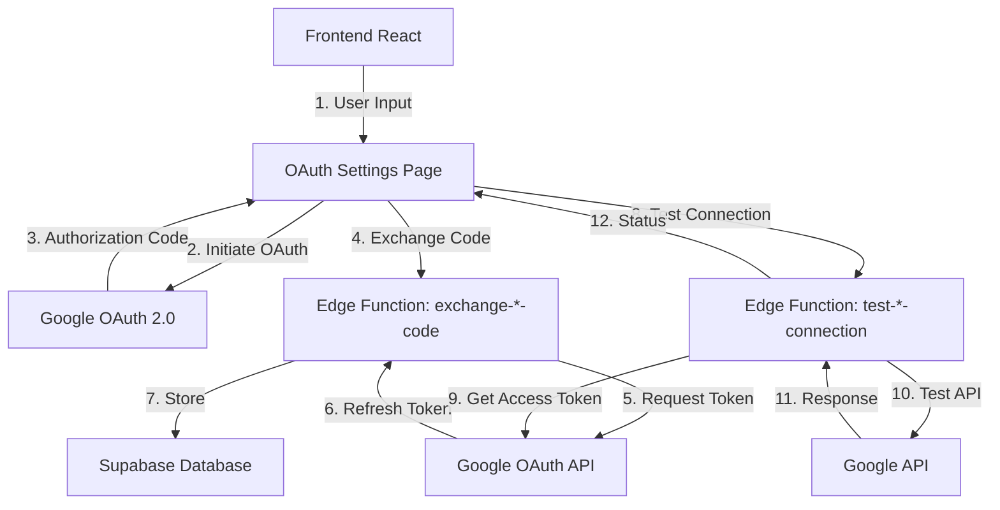
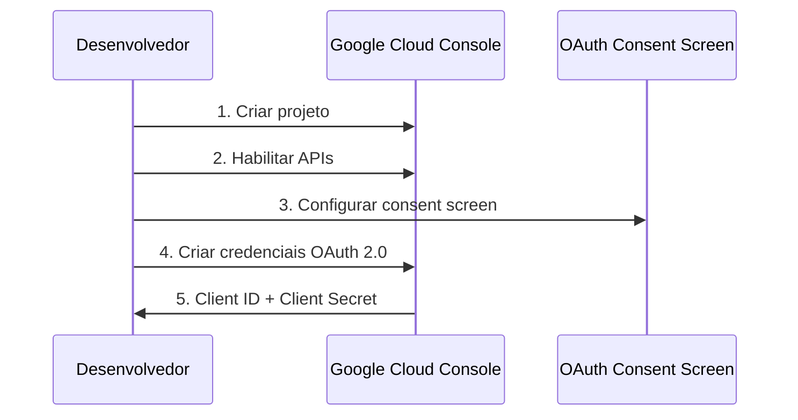
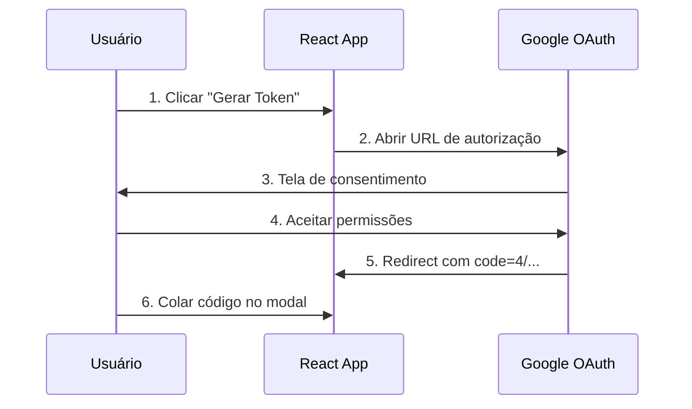
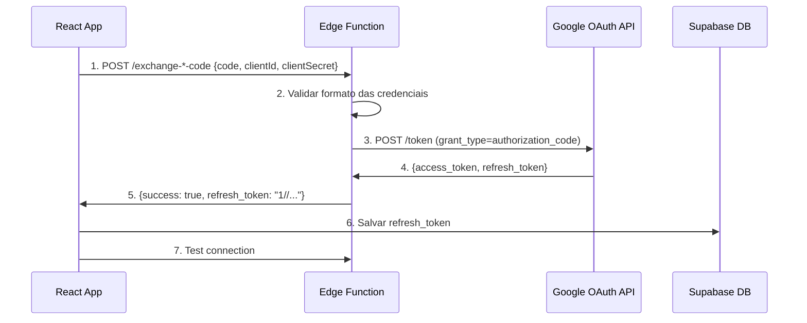
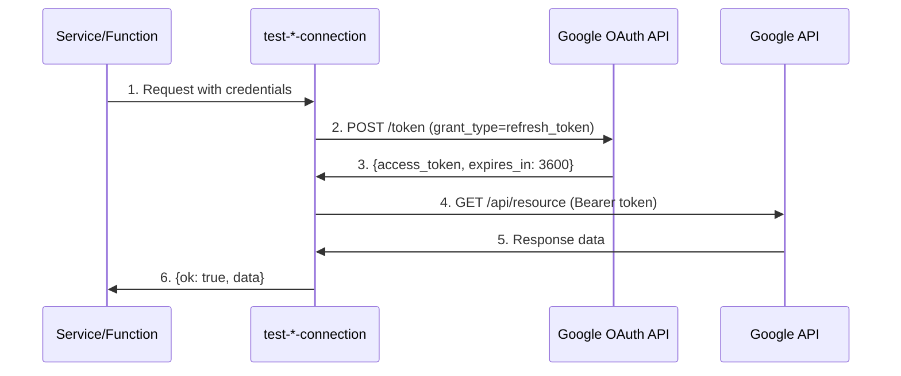

# OAuth 2.0 Architecture Overview

## Visão Geral do Sistema

Este documento descreve a arquitetura completa de OAuth 2.0 implementada para:
- **YouTube Data API v3** (extração de legendas)
- **Google Business Profile API** (extração de avaliações)

## Arquitetura Geral



## Componentes do Sistema

### 1. Frontend (React + TypeScript)
- `src/pages/YouTubeOAuthSettings.tsx`
- `src/pages/GoogleBusinessOAuthSettings.tsx`

**Responsabilidades:**
- Interface de configuração de credenciais OAuth
- Gerenciamento do fluxo de autorização
- Validação de formato de credenciais
- Persistência em localStorage e Supabase
- Teste de conexão

### 2. Backend (Supabase Edge Functions)

#### YouTube OAuth:
- `supabase/functions/exchange-youtube-code/index.ts`
- `supabase/functions/test-youtube-connection/index.ts`

#### Google Business OAuth:
- `supabase/functions/exchange-google-business-code/index.ts`
- `supabase/functions/test-google-business-connection/index.ts`

**Responsabilidades:**
- Troca de authorization code por refresh token
- Validação de credenciais
- Refresh de access tokens
- Teste de conectividade com APIs do Google

### 3. Database (Supabase PostgreSQL)

#### Tabelas:

**youtube_oauth_credentials**
```sql
CREATE TABLE youtube_oauth_credentials (
  id UUID PRIMARY KEY DEFAULT gen_random_uuid(),
  user_id UUID NOT NULL REFERENCES auth.users(id) ON DELETE CASCADE,
  client_id TEXT NOT NULL,
  client_secret TEXT NOT NULL,
  refresh_token TEXT NOT NULL,
  created_at TIMESTAMPTZ DEFAULT now(),
  updated_at TIMESTAMPTZ DEFAULT now(),
  UNIQUE(user_id)
);
```

**google_business_oauth_credentials**
```sql
CREATE TABLE google_business_oauth_credentials (
  id UUID PRIMARY KEY DEFAULT gen_random_uuid(),
  user_id UUID NOT NULL REFERENCES auth.users(id) ON DELETE CASCADE,
  client_id TEXT NOT NULL,
  client_secret TEXT NOT NULL,
  refresh_token TEXT NOT NULL,
  created_at TIMESTAMPTZ DEFAULT now(),
  updated_at TIMESTAMPTZ DEFAULT now(),
  UNIQUE(user_id)
);
```

## Fluxo OAuth 2.0 Completo

### Fase 1: Configuração no Google Cloud Console



### Fase 2: Autorização do Usuário



### Fase 3: Troca de Código por Token



### Fase 4: Uso do Refresh Token



## Validações Implementadas

### YouTube OAuth

| Campo | Validação | Erro |
|-------|-----------|------|
| Client ID | Deve terminar com `.apps.googleusercontent.com` | `invalid_client_id_format` |
| Client ID | Não deve começar com `GOCSPX-` | `client_secret_in_client_id` |
| Client Secret | Deve começar com `GOCSPX-` | `invalid_client_secret_format` |
| Refresh Token | Deve começar com `1//` | Auto-abre modal de troca |
| Refresh Token | Não deve começar com `4/` | `authorization_code_in_refresh` |
| Refresh Token | Não deve começar com `GOCSPX-` | `client_secret_in_refresh` |

### Google Business OAuth

| Campo | Validação | Erro |
|-------|-----------|------|
| Client ID | Deve terminar com `.apps.googleusercontent.com` | `invalid_client_id_format` |
| Client ID | Não deve começar com `GOCSPX-` | `client_secret_in_client_id` |
| Client Secret | Deve começar com `GOCSPX-` | `invalid_client_secret_format` |
| Refresh Token | Deve começar com `1//` | Auto-abre modal de troca |
| Refresh Token | Não deve começar com `4/` | `authorization_code_in_refresh` |
| Refresh Token | Não deve começar com `GOCSPX-` | `client_secret_in_refresh` |

## Escopos OAuth Configurados

### YouTube Data API v3
```
https://www.googleapis.com/auth/youtube.readonly
https://www.googleapis.com/auth/userinfo.email
https://www.googleapis.com/auth/userinfo.profile
```

### Google Business Profile API
```
https://www.googleapis.com/auth/business.manage
https://www.googleapis.com/auth/userinfo.email
https://www.googleapis.com/auth/userinfo.profile
```

## Redirect URIs

- **Production**: `https://landing-craftsman-76.lovable.app/oauth2/callback`
- **YouTube**: `https://landing-craftsman-76.lovable.app/youtube-oauth`
- **Google Business**: `https://landing-craftsman-76.lovable.app/google-business-oauth`

## Segurança

### 1. Armazenamento de Credenciais
- **Client ID/Secret**: Armazenados no banco por usuário
- **Refresh Token**: Armazenado no banco por usuário (criptografado em transit)
- **Access Token**: Nunca armazenado, sempre gerado sob demanda

### 2. RLS (Row Level Security)
```sql
-- Usuários só podem ver suas próprias credenciais
CREATE POLICY "Users can view own credentials" 
ON youtube_oauth_credentials FOR SELECT 
USING (auth.uid() = user_id);

CREATE POLICY "Users can insert own credentials" 
ON youtube_oauth_credentials FOR INSERT 
WITH CHECK (auth.uid() = user_id);

CREATE POLICY "Users can update own credentials" 
ON youtube_oauth_credentials FOR UPDATE 
USING (auth.uid() = user_id);
```

### 3. CORS
Todas as Edge Functions implementam CORS headers:
```typescript
const corsHeaders = {
  'Access-Control-Allow-Origin': '*',
  'Access-Control-Allow-Headers': 'authorization, x-client-info, apikey, content-type',
};
```

## Tratamento de Erros

### Erros Comuns do Google OAuth

| Erro | Causa | Solução |
|------|-------|---------|
| `redirect_uri_mismatch` | URI não cadastrada no GCP | Adicionar URI exata no GCP Console |
| `invalid_grant` (Bad Request) | Código expirado/reutilizado | Gerar novo código |
| `invalid_grant` (redirect_uri) | URI diferente entre authorize e token | Usar mesma URI |
| `invalid_client` | Client ID/Secret incorretos | Verificar credenciais no GCP |
| `access_denied` | Usuário não autorizou | Refazer fluxo de autorização |

### Respostas Padronizadas

**Sucesso:**
```typescript
{
  success: true,
  refresh_token: "1//...",
  credentialSource?: "form" | "database" | "environment"
}
```

**Erro:**
```typescript
{
  success: false,
  error: "error_code",
  error_description: "Descrição detalhada",
  probable_cause?: "causa_provável",
  suggestion?: "Solução sugerida",
  details: {
    // Dados de diagnóstico (sem informações sensíveis)
  }
}
```

## Logging e Monitoramento

### Edge Functions
- Logs estruturados com preview de dados sensíveis
- Tracking de `clientIdLast6`, `redirectUri`, `codePreview`
- Erro/sucesso logados em console

### Frontend
- Toast notifications para feedback ao usuário
- Status badges (✅ Connected, ⚠️ Warning, ❌ Error)
- Display de informações do canal/conta conectada

## Fallback e Resiliência

### Prioridade de Credenciais (Edge Functions)
1. **Body** (dados do formulário)
2. **Database** (credenciais do usuário)
3. **Environment** (variáveis globais - fallback)

### Retry Logic
- Não implementado automático (usuário deve clicar "Testar Agora")
- Refresh token é válido por tempo indefinido (até revogado)
- Access token expira em 1 hora (regenerado automaticamente)

## Métricas e Performance

### Latência Esperada
- **Authorization Flow**: ~2-5s (depende do usuário)
- **Code Exchange**: ~500-1000ms
- **Token Refresh**: ~300-500ms
- **API Test Call**: ~500-1500ms

### Rate Limits
- **Google OAuth API**: ~10 requests/second/user
- **YouTube Data API**: 10,000 units/day (padrão)
- **Business Profile API**: Sem limite público documentado

## Próximos Passos / Melhorias Futuras

1. **Auto-refresh de access tokens** nos serviços de extração
2. **Retry automático** com backoff exponencial
3. **Webhook** para notificação de revogação de tokens
4. **Multi-account support** (múltiplas contas Google por usuário)
5. **Token encryption** em repouso no banco
6. **Audit log** de uso de credenciais OAuth

## Links de Referência

- [Google OAuth 2.0 Docs](https://developers.google.com/identity/protocols/oauth2)
- [YouTube Data API](https://developers.google.com/youtube/v3)
- [Google Business Profile API](https://developers.google.com/my-business)
- [Supabase Edge Functions](https://supabase.com/docs/guides/functions)
