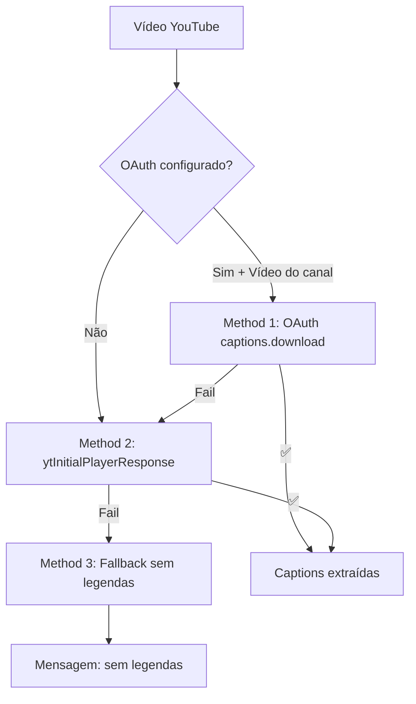

# 🔐 YouTube OAuth 2.0 Setup Guide

Este guia detalha como configurar autenticação OAuth 2.0 para extrair legendas de vídeos do seu canal no YouTube via `captions.download` API.

---

## 📋 Pré-requisitos

- Conta Google com canal no YouTube
- Acesso ao [Google Cloud Console](https://console.cloud.google.com/)
- Acesso ao Supabase Dashboard do projeto

---

## 🚀 Etapa 1: Configurar Google Cloud Project

### 1.1 Criar Projeto

1. Acesse [Google Cloud Console](https://console.cloud.google.com/)
2. Clique em **"Select a project"** → **"NEW PROJECT"**
3. Nome: `YouTube Captions API` (ou similar)
4. Clique em **"CREATE"**

📸 **Screenshot:** `docs/screenshots/01-gcp-create-project.png`

### 1.2 Ativar YouTube Data API v3

1. No menu lateral, vá em **"APIs & Services"** → **"Library"**
2. Busque por: `YouTube Data API v3`
3. Clique em **"ENABLE"**

📸 **Screenshot:** `docs/screenshots/02-enable-youtube-api.png`

### 1.3 Configurar OAuth Consent Screen

1. Vá em **"APIs & Services"** → **"OAuth consent screen"**
2. Escolha **"External"** (ou Internal se G Workspace)
3. Preencha:
   - **App name:** Nome da sua aplicação
   - **User support email:** Seu email
   - **Developer contact:** Seu email
4. Clique em **"SAVE AND CONTINUE"**
5. Em **"Scopes"**, adicione:
   - `https://www.googleapis.com/auth/youtube.force-ssl`
6. Em **"Test users"**, adicione seu email do YouTube
7. Clique em **"SAVE AND CONTINUE"**

📸 **Screenshot:** `docs/screenshots/03-oauth-consent.png`

### 1.4 Criar Credenciais OAuth 2.0

1. Vá em **"APIs & Services"** → **"Credentials"**
2. Clique em **"CREATE CREDENTIALS"** → **"OAuth client ID"**
3. Tipo: **"Web application"**
4. Nome: `YouTube OAuth Client`
5. **Authorized redirect URIs:**
   - `http://localhost:3000/oauth2/callback`
6. Clique em **"CREATE"**
7. **Copie:**
   - `Client ID` (formato: `xxx.apps.googleusercontent.com`)
   - `Client Secret` (formato: `GOCSPX-xxx`)

📸 **Screenshot:** `docs/screenshots/04-oauth-credentials.png`

---

## 🔑 Etapa 2: Gerar Refresh Token

### 2.1 Rodar Script Interativo

```bash
npm install
npm run oauth:youtube
```

### 2.2 Autorizar Aplicação

1. O script exibirá uma URL
2. Abra no navegador e faça login com a conta do YouTube
3. Autorize o acesso
4. Você será redirecionado para `localhost:3000` (pode dar erro, ok!)
5. O script exibirá os tokens

**Exemplo de saída:**
```
🎉 Tokens obtidos com sucesso!

📝 Adicione estes secrets no Supabase Dashboard:

YOUTUBE_CLIENT_ID=123456789.apps.googleusercontent.com
YOUTUBE_CLIENT_SECRET=GOCSPX-xxxxxxxxxxxxxxxx
YOUTUBE_REFRESH_TOKEN=1//0xxxxxxxxxxxxxxxxxxxxxxxx

⚠️  Guarde o REFRESH_TOKEN com segurança!
```

---

## 🔐 Etapa 3: Configurar Secrets no Supabase

### 3.1 Adicionar Secrets

1. Acesse [Supabase Dashboard](https://supabase.com/dashboard/)
2. Selecione seu projeto
3. Vá em **"Project Settings"** → **"Edge Functions"** → **"Secrets"**
4. Adicione:

```bash
YOUTUBE_CLIENT_ID=xxx.apps.googleusercontent.com
YOUTUBE_CLIENT_SECRET=GOCSPX-xxx
YOUTUBE_REFRESH_TOKEN=1//0xxx
```

📸 **Screenshot:** `docs/screenshots/05-supabase-secrets.png`

### 3.2 Verificar Configuração

Execute no terminal:
```bash
npm run test:captions
```

**Saída esperada:**
```
🧪 Testando: Vídeo público com CC (Method 2)
✅ PASSED: Method: direct-playerResponse-json, Captions: 0 chars

📊 Resultados: 2/2 testes passaram
```

---

## 🔄 Fluxo de Extração



---

## 🐛 Troubleshooting

### ❌ `redirect_uri_mismatch`

**Causa:** URI de redirecionamento não configurado no GCP

**Solução:**
1. Verifique no GCP: `http://localhost:3000/oauth2/callback`
2. Rode novamente: `npm run oauth:youtube`

---

### ❌ `invalid_grant`

**Causa:** Refresh token expirado ou inválido

**Solução:**
1. Refaça OAuth: `npm run oauth:youtube`
2. Atualize `YOUTUBE_REFRESH_TOKEN` no Supabase

---

### ❌ `API keys are not supported by this API`

**Causa:** Tentando usar API key em vez de OAuth

**Solução:**
- OAuth é obrigatório para `captions.download`
- Siga este guia para configurar

---

### ⚠️ Logs poluídos com captions enormes

**Causa:** Logs não truncados

**Solução:**
- Verifique `logCaptionPreview()` no `index.ts` linha 34
- Deve truncar em 200 chars

---

### ❌ Testes falhando

**Causa:** Product IDs de teste inválidos

**Solução:**
1. Edite `scripts/test-youtube-extraction.ts`
2. Substitua `productId` por IDs reais do Supabase
3. Rode novamente: `npm run test:captions`

---

## 📊 Comparação de Métodos

| Método | Vídeo | OAuth? | Precisão | Latência | Uso |
|--------|-------|--------|----------|----------|-----|
| **Method 1** | Seu canal | ✅ | 🟢 Alta | ~3s | Vídeos próprios |
| **Method 2** | Público + CC | ❌ | 🟢 Alta | ~2s | Vídeos de terceiros |
| **Method 3** | Sem legendas | ❌ | 🔴 Nenhuma | ~1s | Fallback |

---

## 🎯 Próximos Passos

1. ✅ Configure secrets no Supabase
2. ✅ Rode `npm run test:captions`
3. ✅ Teste extração via UI (`/repository`)
4. ✅ Verifique logs no Supabase Edge Logs
5. ✅ Valide análise IA (se `DEEPSEEK_API_KEY` configurado)

---

## 📚 Referências

- [YouTube Data API v3 - Captions](https://developers.google.com/youtube/v3/docs/captions)
- [Google OAuth 2.0](https://developers.google.com/identity/protocols/oauth2)
- [Supabase Edge Functions](https://supabase.com/docs/guides/functions)

---

**Última atualização:** 2025-10-02
